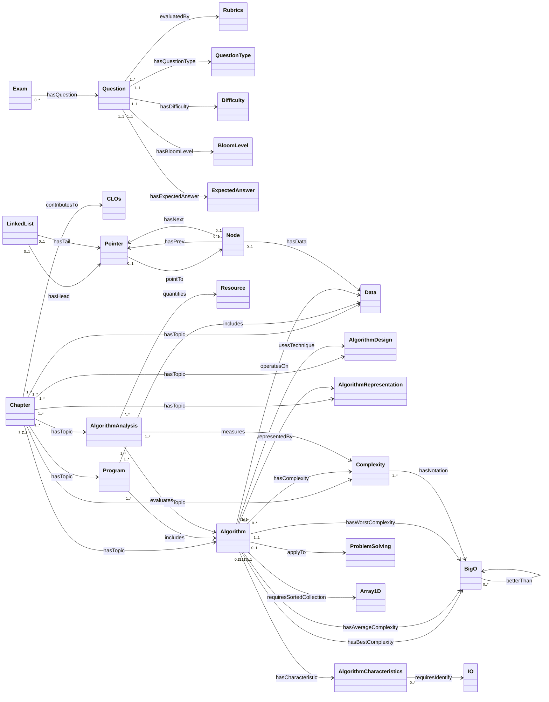
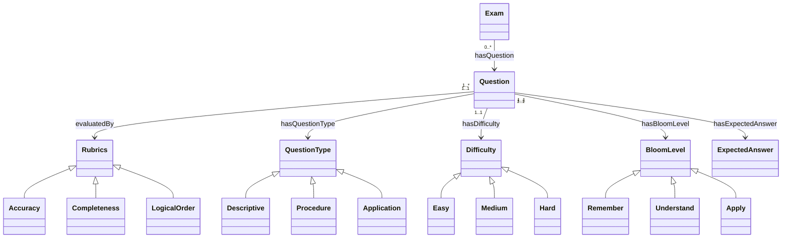
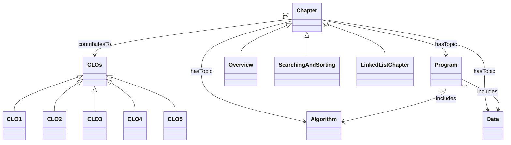
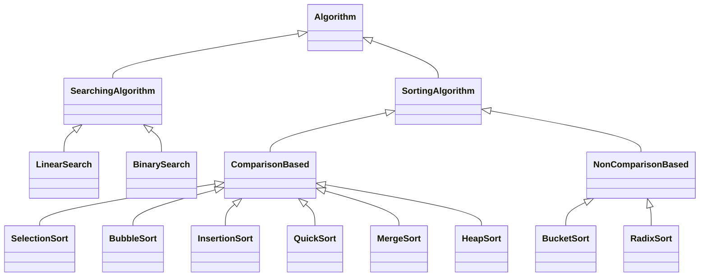
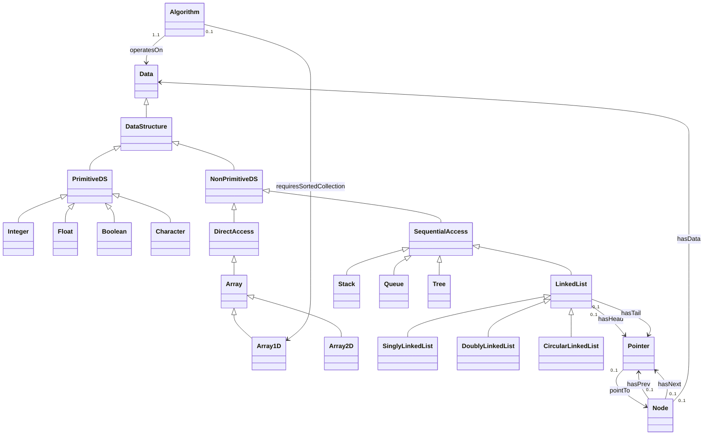

# Sơ đồ thực thể và quan hệ — DSA Knowledge Base

Nguồn: `ontology/concepts.json`, `ontology/hierarchy.json`, `ontology/relations.json`.

Ký hiệu:

- `A <|-- B`: B là subclass của A (hierarchy `H`)
- `A --> B : name`: quan hệ Rel từ A tới B, nhãn cạnh là `name`
- Số trên cạnh là cardinality của Rel

---

## 1. Tổng quan quan hệ (T-Box Rel)

Chỉ vẽ concept cha — subclass xem các mục 2–6.

---

## 2. Miền đánh giá (Assessment)

---

## 3. Chương và chuẩn đầu ra

`hasTopic` trỏ tới Algorithm, AlgorithmAnalysis, AlgorithmDesign, Complexity, Data, Program, AlgorithmRepresentation (và các subclass khi instantiate).

---

## 4. Thuật toán, phân tích và độ phức tạp

```mermaid
classDiagram
    Algorithm "0..1" --> ProblemSolving : applyTo
    Algorithm "0..*" --> AlgorithmCharacteristic : hasCharacteristic
    Algorithm "0..*" --> Complexity : hasComplexity
    Algorithm "1..1" --> BigO : hasBestComplexity
    Algorithm "1..1" --> BigO : hasAverageComplexity
    Algorithm "1..1" --> BigO : hasWorstComplexity
    Algorithm "1..1" --> AlgorithmDesign : usesTechnique
    Algorithm "1..1" --> Data : operatesOn
    Algorithm "0..*" --> AlgorithmRepresentation : representedBy
    Algorithm "0..1" --> Array1D : requiresSortedCollection

    AlgorithmCharacteristic "0..*" --> IO : requiresIdentify

    AlgorithmAnalysis "1..*" --> Algorithm : evaluates
    AlgorithmAnalysis "1..*" --> Complexity : measures
    AlgorithmAnalysis "*..*" --> Resource : quantifies

    Complexity "1..*" --> BigO : hasNotation
    BigO "0..*" --> BigO : betterThan

    AlgorithmAnalysis <|-- TheoreticalAnalysis
    AlgorithmAnalysis <|-- ExperimentalAnalysis

    Resource <|-- ExecutionTime
    Resource <|-- MemoryUsage

    IO <|-- Input
    IO <|-- Output

    AlgorithmCharacteristic <|-- Definiteness
    AlgorithmCharacteristic <|-- Finiteness
    AlgorithmCharacteristic <|-- Correctness
    AlgorithmCharacteristic <|-- Efficiency
    AlgorithmCharacteristic <|-- Feasibility

    AlgorithmDesign <|-- DivideAndConquer
    AlgorithmDesign <|-- DynamicProgramming
    AlgorithmDesign <|-- Greedy
    AlgorithmDesign <|-- Backtracking
    AlgorithmDesign <|-- BruteForce
    AlgorithmDesign <|-- Recursive

    Complexity <|-- TimeComplexity
    Complexity <|-- SpaceComplexity

    BigO <|-- ConstantTime
    BigO <|-- LogarithmicTime
    BigO <|-- LinearTime
    BigO <|-- LinearithmicTime
    BigO <|-- QuadraticTime
    BigO <|-- ExponentialTime
    BigO <|-- FactorialTime

    AlgorithmRepresentation <|-- Pseudocode
    AlgorithmRepresentation <|-- Flowchart
    AlgorithmRepresentation <|-- NaturalLanguage
```

### Phân cấp thuật toán tìm kiếm / sắp xếp

Phạm vi ba chương: tìm kiếm tuyến tính/nhị phân và bubble / selection / insertion là nội dung cốt lõi chương 2. Quick / Merge / Heap / Bucket / Radix có trong T-Box nhưng không là `hasTopic` của chương 2.

---

## 5. Cấu trúc dữ liệu và danh sách liên kết

Stack, Queue, Tree có trong hierarchy để phân loại CTDL; dự án không đi sâu A-Box của các loại này.

---

## 6. Bảng Rel đầy đủ

| ID | name | source | cardinality | target |
|---|---|---|---|---|
| REL_EXAM_HAS_QUESTION | hasQuestion | Exam | (0..*) | Question |
| REL_QUESTION_HAS_RUBRICS | evaluatedBy | Question | (1..*) | Rubrics |
| REL_QUESTION_HAS_QUESTION_TYPE | hasQuestionType | Question | (1..1) | Question Type |
| REL_QUESTION_HAS_DIFFICULTY | hasDifficulty | Question | (1..1) | Difficulty |
| REL_QUESTION_HAS_BLOOM_LEVEL | hasBloomLevel | Question | (1..1) | BloomLevel |
| REL_QUESTION_HAS_EXPECTED_ANSWER | hasExpectedAnswer | Question | (1..1) | Expected Answer |
| REL_PROGRAM_INCLUDES | includes | Program | (1..*) | Algorithm, Data |
| REL_CHAPTER_CONTRIBUTES_TO_CLOS | contributesTo | Chapter | (1..*) | CLOs |
| REL_CHAPTER_HAS_TOPIC | hasTopic | Chapter | (1..*) | Algorithm, AlgorithmAnalysis, AlgorithmDesign, Complexity, Data, Program, AlgorithmRepresentation |
| REL_ALGORITHM_APPLY_TO_PROBLEM_SOLVING | applyTo | Algorithm | (0..1) | Problem solving |
| REL_ALGORITHM_HAS_CHARACTERISTIC | hasCharacteristic | Algorithm | (0..*) | Algorithm characteristic |
| REL_DEFINITENESS_REQUIRES_IDENTIFY_IO | requiresIdentify | Algorithm characteristic | (0..*) | IO |
| REL_ALGORITHM_ANALYSIS_EVALUATES_ALGORITHM | evaluates | Algorithm analysis | (1..*) | Algorithm |
| REL_ALGORITHM_ANALYSIS_MEASURES_COMPLEXITY | measures | Algorithm analysis | (1..*) | Complexity |
| REL_ALGORITHM_ANALYSIS_QUANTIFIES_RESOURCE | quantifies | Algorithm analysis | (*..*) | Resource |
| REL_ALGORITHM_HAS_COMPLEXITY | hasComplexity | Algorithm | (0..*) | Complexity |
| REL_COMPLEXITY_HAS_NOTATION_BIG_O | hasNotation | Complexity | (1..*) | Big O |
| REL_BIG_O_BETTER_THAN_BIG_O | betterThan | Big O | (0..*) | Big O |
| REL_LINKED_LIST_HAS_HEAD_POINTER | hasHead | Linked List | (0..1) | Pointer |
| REL_LINKED_LIST_HAS_TAIL_POINTER | hasTail | Linked List | (0..1) | Pointer |
| REL_NODE_HAS_PREV_POINTER | hasPrev | Node | (0..1) | Pointer |
| REL_NODE_HAS_NEXT_POINTER | hasNext | Node | (0..1) | Pointer |
| REL_NODE_HAS_DATA | hasData | Node | (0..1) | Data |
| REL_POINTER_POINT_TO_NODE | pointTo | Pointer | (0..1) | Node |
| REL_ALGORITHM_HAS_BEST_COMPLEXITY | hasBestComplexity | Algorithm | (1..1) | Big O |
| REL_ALGORITHM_HAS_AVERAGE_COMPLEXITY | hasAverageComplexity | Algorithm | (1..1) | Big O |
| REL_ALGORITHM_HAS_WORST_COMPLEXITY | hasWorstComplexity | Algorithm | (1..1) | Big O |
| REL_ALGORITHM_USES_TECHNIQUE | usesTechnique | Algorithm | (1..1) | Algorithm design |
| REL_ALGORITHM_OPERATES_ON_DATA | operatesOn | Algorithm | (1..1) | Data |
| REL_ALGORITHM_REPRESENTED_BY | representedBy | Algorithm | (0..*) | Algorithm Representation |
| REL_ALGORITHM_REQUIRES_SORTED_COLLECTION | requiresSortedCollection | Algorithm | (0..1) | 1D Array |
